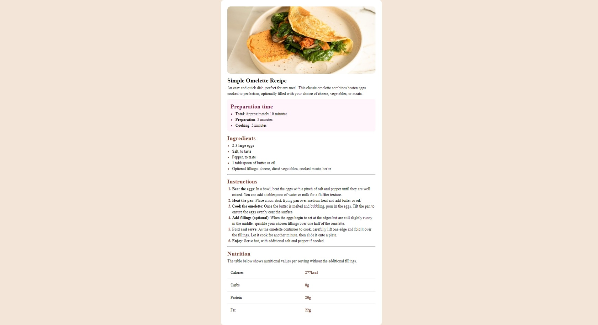

# Frontend Mentor - Recipe page solution

This is a solution to the [Recipe page challenge on Frontend Mentor](https://www.frontendmentor.io/challenges/recipe-page-KiTsR8QQKm). Frontend Mentor challenges help you improve your coding skills by building realistic projects. 

## Table of contents

- [Overview](#overview)
  - [Screenshot](#screenshot)
  - [Links](#links)
- [My process](#my-process)
  - [Built with](#built-with)
  - [What I learned](#what-i-learned)
- [Author](#author)

## Overview

### Screenshot



### Links

- [Solution URL](https://github.com/thamu-acn/recipe-page)
- [Live site URL](https://thamu-acn.github.io/recipe-page/)

## My process

### Built with

- Semantic HTML5 markup
- CSS psuedo clases
- Flexbox

### What I learned

Styling bullets or numbers for list items

```css
ul li::marker {
    color: hsl(14, 45%, 36%);
}
```

## Author

- Name - Thamsanqa Ndebele
- Frontend Mentor - [@thamu-acn](https://www.frontendmentor.io/profile/thamu-acn)
- LinkedIn - [Thamsanqa Ndebele](https://www.linkedin.com/in/thamsanqa-ndebele-12988487/)
